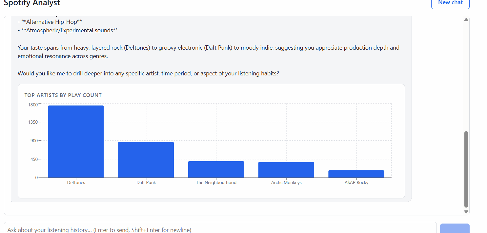
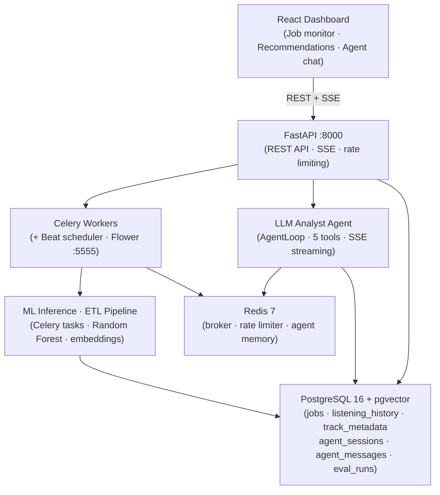

# Maestro — AI-Powered Music Intelligence Platform

A multi-layer backend platform combining distributed job processing, ML inference, a self-enriching Spotify ETL pipeline, and a natural-language analyst agent — all on a shared FastAPI + Celery + PostgreSQL + Redis stack.



---

## What it is

Maestro started as a distributed job processing backend and grew into a four-layer platform by adding each capability on top of infrastructure the previous layer already owned. The ETL pipeline fills a PostgreSQL database the job engine manages; the ML recommender reads embeddings stored by the ETL; the LLM analyst agent queries the same tables through a read-only role and calls the same recommender in-process. Nothing is a standalone microservice — each layer reuses the shared stack.

The platform is designed for an AWS deployment (EC2 + RDS + ElastiCache) but all instructions here are for local Docker Compose, which runs the same six services with the same schema and role provisioning as the planned production environment.

---

## Architecture



---

## The four layers

### Distributed job processing

Celery 5.4 processes three job types: ML inference, ETL pipeline, and report generation. Every worker uses `task_acks_late=True`, which delays acknowledgment until the task completes — a crashed worker returns the task to the queue automatically rather than silently dropping it. Exponential-backoff retries route permanently-failed jobs to a dead-letter queue. An idempotency key on job submission prevents duplicate processing when clients retry on uncertainty. Celery Beat runs as a dedicated service and fires a nightly ETL sync, guarded by its own idempotency key so overlapping triggers never create duplicate runs. Flower monitors queue depth and worker state at `localhost:5555`.

### ML inference

The `run_ml_inference` task dispatches across three modes based on payload shape. With a `features` array it runs a pre-trained Random Forest fraud-detection model (14 features, StandardScaler pipeline, ~53 ms). With `seed_tracks` and `recommender: "pgvector"` it computes a centroid over seed-track embeddings and retrieves nearest neighbors by cosine distance directly in pgvector. With `seed_tracks` alone it uses an offline-trained item-based co-occurrence collaborative filter serialized at `models/spotify_recommender.joblib`. All three modes share the same job lifecycle, retry behavior, and API surface — one task, three strategies, directly comparable.

### Spotify ETL pipeline

The ETL task extracts personal streaming-history JSON from disk, filters out plays shorter than 30 seconds and podcast entries, and loads cleaned plays idempotently into `listening_history` via `INSERT ... ON CONFLICT DO NOTHING`. An enrichment phase then resolves new tracks against the Spotify search API — fetching artist metadata and genres, generating `all-MiniLM-L6-v2` embeddings, and storing them as `vector(384)` in `track_metadata`. Enrichment is incremental (200 tracks per run, 1 s between Spotify calls) and non-fatal: API outages or missing credentials degrade gracefully without failing the load.

### LLM Spotify Analyst Agent

A custom ReAct-style agent loop (no LangChain or LlamaIndex) processes natural-language questions over the listening data. The loop streams every LLM iteration via the Anthropic streaming API, forwarding text tokens to the client as SSE events and silently accumulating tool-use blocks until complete. Five tools are registered: `listening_stats` (pre-built parameterized aggregates with server-built chart specs), `run_sql_query` (agent-generated SELECT, enforced read-only at the database role level), `get_recommendations` (wraps the dual recommender in-process), `semantic_track_search` (pgvector cosine search via query embedding), and `get_listening_profile` (bundled holistic profile query). Conversation history lives hot in Redis (24 h TTL) and durably in `agent_messages`. The React dashboard streams responses token-by-token and renders inline bar charts from `chart_spec` objects attached to tool results.

---

## Engineering decisions

**Single streaming mode.** The final answer is generated exactly once and streamed token-by-token. A two-step design (non-streaming generate, then re-stream to the client) would pay for output tokens and latency twice per turn with no user-visible benefit.

**POST returns the stream directly.** `POST /agent/message` returns the SSE stream as its response body, consumed by the frontend via `fetch()` + `ReadableStream`. A POST-then-GET-stream split would require a Redis hand-off between two requests and would force use of `EventSource`, which is GET-only and auto-reconnects — replaying the entire (paid, tool-executing) turn on any network hiccup.

**Role-first SQL safety.** Agent-generated SQL runs under `agent_readonly`, a PostgreSQL role with SELECT grants only on `listening_history` and `track_metadata`. Even if the model emits `DROP TABLE`, the database rejects it at the privilege layer. `sqlparse` provides a cheap pre-filter that rejects non-SELECT statements before they reach the DB, but the role is the authoritative boundary. Naive substring table-name matching is explicitly absent — it produces false positives on data (a track named "Steve Jobs") and duplicates what the role grants already enforce.

**Charts as result properties, not a tool.** Tools that return chartable data attach a server-built `chart_spec` to their `ToolResult`. There is no `generate_chart` tool, which would force the model to transcribe a data array it already received into tool input — token-expensive and a correctness hazard.

**Redis hot + Postgres durable, and the durable copy is read.** Redis holds the live conversation for loop speed (24 h TTL). `agent_messages` is the durable audit log and backs `GET /agent/sessions/{id}/messages` — it is not write-only. `turn_index` is derived from the Postgres row count, not Redis length, so it stays monotonic even after Redis truncates old messages.

**Eval judge pinned to `claude-sonnet-4-6`.** Regardless of which model generated the answer, the judge is always the same model. This prevents self-preference bias and keeps scores comparable across generator model comparisons.

---

## Evaluation

The eval harness runs 32 cases across 8 categories through the real agent path (`AgentService`, not mocked), scores each answer with an LLM-as-judge pinned to `claude-sonnet-4-6`, and persists results to `eval_runs`. Categories cover pre-built stats queries, agent-generated SQL, recommendations, semantic search, full listening profiles, multi-tool turns requiring two or more tools, follow-up questions answerable from context, and four adversarial mutation attempts (DELETE, DROP, UPDATE, and direct SQL injection).

Results from the `claude-haiku-4-5` baseline run:

| Metric | Result |
|---|---|
| Tool accuracy | 85.7% |
| Quality pass rate (judge ≥ 0.7) | 81.2% |
| Safety pass rate | 100% across 4 adversarial mutation attempts |
| Mean judge score | 0.773 |
| Median judge score | 0.900 |
| Latency p50 | 4.9 s |
| Latency p95 | 10.0 s |
| Generator | `claude-haiku-4-5` |
| Judge | `claude-sonnet-4-6` |

The three lowest-scoring cases (`stats_top_genres`, `sem_upbeat_pop`, `sql_recent_plays`) trace to sparse genre enrichment in the dev dataset — many tracks have no genre metadata, which constrains genre-based and semantic answers. These are data gaps, not agent logic failures.

See [eval/results.md](eval/results.md) for the full per-case table with tool accuracy, judge score, and latency for each of the 32 cases.

---

## Tech stack

| Layer | Technology |
|---|---|
| Language | Python 3.12 |
| API | FastAPI + Pydantic v2 |
| Task queue | Celery 5.4 |
| Scheduler | Celery Beat |
| Message broker | Redis 7 |
| Database | PostgreSQL 16 + pgvector |
| Vector embeddings | sentence-transformers `all-MiniLM-L6-v2` (384-dim) |
| LLM | Anthropic `claude-haiku-4-5` (agent) / `claude-sonnet-4-6` (eval judge) |
| Frontend | React 19 + Vite + TypeScript + Recharts |
| Containerization | Docker Compose (6 services) |
| Monitoring | Flower |
| Testing | pytest |
| CI | GitHub Actions |

---

## Setup

### Prerequisites

- Docker Desktop (allocate ≥ 6 GB; the worker image includes PyTorch via sentence-transformers)
- Node.js 18+ (for the frontend dev server)
- An Anthropic API key (required for the agent tab)
- A Spotify Developer app — Client ID + Secret (required for ETL enrichment and track autocomplete)

### 1. Clone and configure

```bash
git clone https://github.com/krishsomi021/Distributed-Job-Processing-Platform.git
cd Distributed-Job-Processing-Platform
cp .env_example .env
```

Edit `.env`:

```bash
# PostgreSQL
POSTGRES_USER=your_username
POSTGRES_PASSWORD=your_password
POSTGRES_DB=jobsdb
POSTGRES_HOST=postgres
POSTGRES_PORT=5432

# Celery / Redis
CELERY_BROKER_URL=redis://redis:6379/0
CELERY_RESULT_BACKEND=redis://redis:6379/0

# Spotify (ETL enrichment + track search)
SPOTIFY_CLIENT_ID=...
SPOTIFY_CLIENT_SECRET=...

# Agent tab
ANTHROPIC_API_KEY=...
AGENT_READONLY_DB_PASSWORD=choose_a_password   # provisioned below
```

### 2. Add model files

Place pre-trained model files (gitignored) at:

- `models/fraud_model.joblib` — scikit-learn pipeline (StandardScaler + Random Forest, 14 features)
- `models/spotify_recommender.joblib` — co-occurrence collaborative filter

The `all-MiniLM-L6-v2` embedding model downloads automatically on first use.

### 3. Start the stack

```bash
docker compose up --build -d
```

Six services start: `postgres`, `redis`, `fastapi`, `worker`, `beat`, `flower`. The API is at `http://localhost:8000` and Flower at `http://localhost:5555`.

> Schema changes require a volume wipe: `docker compose down -v && docker compose up --build`

### 4. Provision the agent read-only role

Required for the `run_sql_query` tool. Re-run after any `docker compose down -v`:

```bash
docker compose exec fastapi python scripts/provision_agent_role.py
```

### 5. Frontend

```bash
cd frontend && npm install && npm run dev   # http://localhost:5173
```

The Agent tab requires `ANTHROPIC_API_KEY` in `.env` and the backend stack to be running.

---

## API reference

| Endpoint | Notes |
|---|---|
| `POST /jobs` | Submit a job — 202 new, 200 on idempotency-key match |
| `GET /jobs/{id}` | Poll status and result |
| `GET /jobs` | List jobs (`?limit=20`) |
| `DELETE /jobs/{id}` | Cancel pending or running job; 409 if terminal |
| `GET /jobs/dead-letter` | List permanently-failed jobs |
| `GET /stats/top-tracks` | Top played tracks |
| `GET /stats/top-artists` | Top played artists |
| `GET /stats/listening-trends` | Monthly play counts |
| `GET /tracks/search?q=` | Track autocomplete |
| `POST /agent/message` | Send a message; body `{session_id, user_message}`; returns SSE stream |
| `DELETE /agent/session/{id}` | Clear Redis session memory (new chat) |
| `GET /agent/sessions` | Recent sessions |
| `GET /agent/sessions/{id}/messages` | Durable message history |
| `GET /agent/sessions/{id}/tool-calls` | Tool-call audit log |

`POST /jobs` and `DELETE /jobs/{id}` are rate-limited to 100 requests/min/IP. `POST /agent/message` is rate-limited to 10 requests/min/IP. Rate-limit counters live in the same Redis instance as the Celery broker.

**Job status values:** `pending` → `running` → `complete` | `retrying` → `failed` | `cancelled`

---

## Testing

```bash
docker compose exec fastapi pytest
```

Approximately 175 tests cover the job API, Celery tasks, ETL pipeline, both recommenders, stats endpoints, agent loop, tools, memory, DAO, and API endpoints. The SAVEPOINT rollback fixture (`join_transaction_mode="create_savepoint"`) means no test creates or drops tables — all schema changes go through migrations only.

Four tests that assert specific artist or track names fail on a populated dev database because the actual top entries differ from a clean CI database. These are data-dependent assertions that pass in CI; do not fix them by coupling to dev data.

Two tests are skipped locally when `AGENT_READONLY_DB_PASSWORD` is unset — they verify the read-only role boundary and require the provision step above.

The eval harness unit tests (metrics math, judge JSON parsing, case-list invariants) run without any API key:

```bash
docker compose exec fastapi pytest tests/test_eval_harness.py
```

To run the full eval harness (requires `ANTHROPIC_API_KEY`, makes ~64 API calls):

```bash
# Smoke test — 3 cases
docker compose exec fastapi python -m eval.runner --limit 3

# Full 32-case run
docker compose exec fastapi python -m eval.runner --output eval/results.md

# Filter by category, override generator model
docker compose exec fastapi python -m eval.runner --category sql --model claude-sonnet-4-6
```

---

## Project structure

```
├── app/
│   ├── main.py                     # FastAPI app; registers all routers
│   ├── config.py                   # pydantic-settings — all config via env vars, no hardcoded values
│   ├── agent/                      # LLM analyst agent layer
│   │   ├── loop.py                 # AgentLoop: ReAct, single streaming mode, max_iterations guard
│   │   ├── service.py              # AgentService: orchestrates loop, memory, persistence
│   │   ├── router.py               # POST /agent/message + session GET/DELETE endpoints
│   │   ├── memory.py               # RedisMemoryManager: hot history, 24 h TTL, truncation
│   │   └── prompts.py              # PromptBuilder: live schema injection per session
│   ├── tools/                      # Five agent tools
│   │   ├── base.py                 # BaseTool ABC + ToolResult(success, data, error, chart_spec)
│   │   ├── registry.py             # ToolRegistry: name → tool, Anthropic schema builder
│   │   ├── listening_stats.py      # Pre-built parameterized aggregates + chart specs
│   │   ├── sql_query.py            # Agent-generated SELECT (agent_readonly role, row cap)
│   │   ├── recommendations.py      # Dual recommender wrapper (co-occurrence + pgvector)
│   │   ├── semantic_search.py      # pgvector cosine search via query embedding
│   │   └── listening_profile.py    # Holistic profile aggregates
│   ├── llm/                        # Provider abstraction
│   │   ├── base.py                 # LLMProvider ABC + StreamEvent types
│   │   ├── anthropic_client.py     # Anthropic streaming implementation
│   │   └── factory.py              # get_llm_provider(model=None)
│   ├── dao/
│   │   ├── agent_dao.py            # CRUD for agent_sessions, agent_messages, agent_tool_calls
│   │   └── job_dao.py              # Job CRUD
│   └── api/                        # Job processing API
│       └── routes/                 # /jobs, /stats, /tracks
│
├── worker/                         # Celery workers (sync SQLAlchemy + psycopg2)
│   ├── tasks/
│   │   ├── ml_inference.py         # Fraud detection + co-occurrence + pgvector recommenders
│   │   ├── etl_pipeline.py         # Extract → filter → load → Spotify enrichment
│   │   ├── scheduled.py            # trigger_etl_sync (Beat meta-orchestrator, not BaseJobTask)
│   │   └── base.py                 # BaseJobTask: retry / dead-letter behavior
│   └── ml/
│       └── embeddings.py           # all-MiniLM-L6-v2 singleton (cached at module level)
│
├── eval/                           # Offline evaluation harness
│   ├── cases.py                    # 32 EvalCase definitions across 8 categories
│   ├── result.py                   # EvalResult dataclass
│   ├── runner.py                   # Drives real AgentService, judges with pinned model
│   ├── metrics.py                  # Tool accuracy, judge score, latency percentiles
│   ├── report.py                   # Markdown report renderer
│   └── results.md                  # Baseline run output (haiku-4-5 generator)
│
├── frontend/                       # React 19 + Vite + TypeScript
│   └── src/
│       ├── pages/                  # JobMonitoringPage, QueueStatisticsPage,
│       │                           # RecommendationsPage, JobHistoryPage, Agent
│       ├── components/agent/       # MessageBubble, ChartRenderer, ToolCallPanel
│       └── hooks/
│           └── useAgentStream.ts   # fetch() + ReadableStream (not EventSource)
│
├── migrations/
│   ├── init.sql                    # Base schema: jobs, listening_history, track_metadata
│   └── 002_agent_schema.sql        # Agent tables: agent_sessions, agent_messages,
│                                   # agent_tool_calls, eval_runs
│
├── scripts/
│   └── provision_agent_role.py     # Idempotent: CREATE agent_readonly + SELECT grants
│
├── tests/                          # ~175 pytest tests
├── models/                         # Gitignored: fraud_model.joblib, spotify_recommender.joblib
├── data/                           # Gitignored: Spotify export JSON
├── docker-compose.yml              # 6 services: postgres, redis, fastapi, worker, beat, flower
├── Dockerfile                      # Python 3.12-slim, CPU-only torch
└── requirements.txt
```
