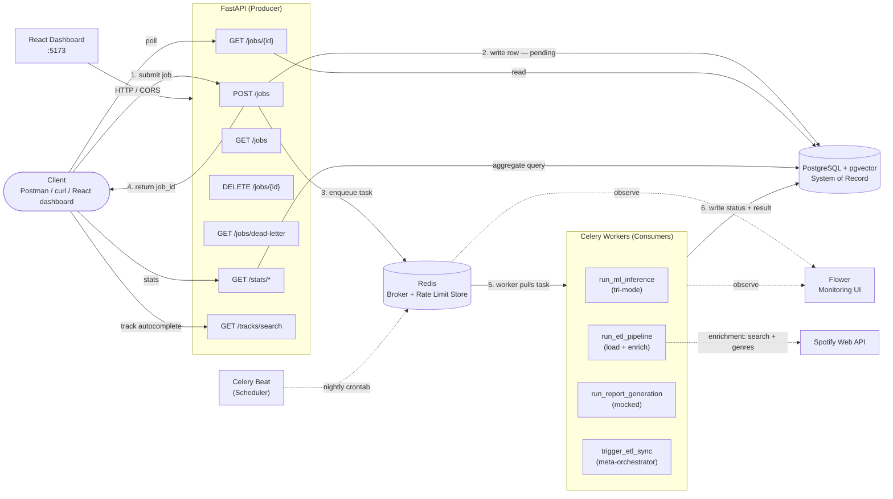
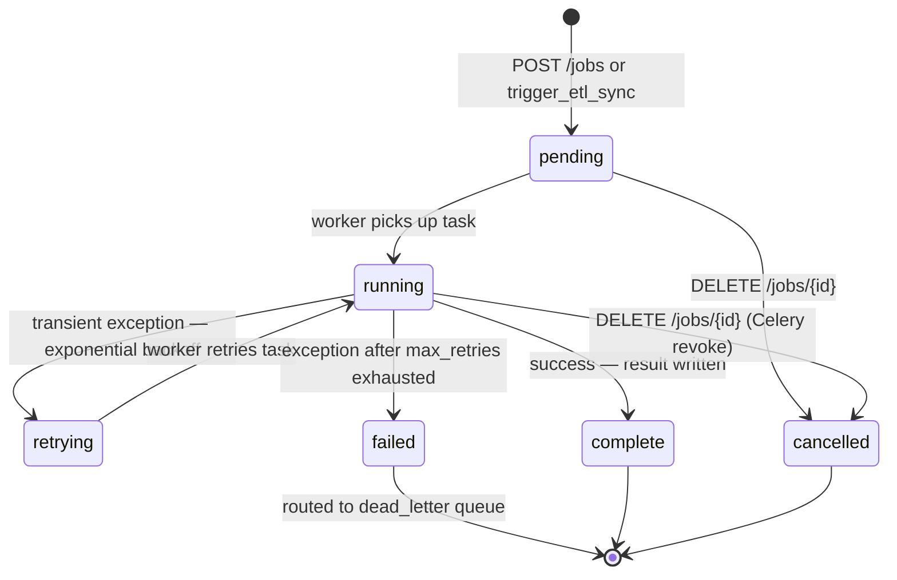

# Architecture — Distributed Job Processing Platform

---

## 1. System Design Overview

The platform follows a **producer–broker–consumer** pattern, the standard architecture for asynchronous background processing.

| Role | Component | Responsibility |
|---|---|---|
| Producer | FastAPI | Accepts requests, validates payloads, writes job records, enqueues tasks |
| Scheduler | Celery Beat | Fires a scheduled ETL sync nightly — produces work autonomously |
| Broker | Redis | Holds pending tasks, decouples submission from execution, stores rate-limit counters |
| Consumer | Celery Workers | Pulls tasks, executes job logic, writes results back to Postgres |
| Store | PostgreSQL + pgvector | Durable record of every job, listening history, and track embeddings |

The API never executes work. It hands off immediately and returns a `job_id` to the client in under 100ms regardless of how long the job takes. If a worker is busy or crashes, Redis buffers the work and preserves it.

---

## 2. System Diagram



---

## 3. Core Components

### FastAPI — the Producer

The public-facing API. Validates incoming requests with Pydantic v2, writes the initial job record to Postgres with `status = pending`, and enqueues the Celery task to Redis. Returns `job_id` immediately — the request completes before any work runs.

Uses **async SQLAlchemy + asyncpg** so database calls never block the event loop. **CORS** is configured via `CORSMiddleware`, with allowed origins read from the `CORS_ORIGINS` setting (default: `http://localhost:5173`) so the React dashboard can call the API from a different origin.

Endpoints:

| Method | Path | Description | Rate-limited |
|---|---|---|---|
| `POST` | `/jobs` | Validate payload, check idempotency key, persist job as `pending`, enqueue task, return `job_id` (202 new / 200 duplicate) | 100 req/min/IP |
| `GET` | `/jobs/{id}` | Read current status and result for one job | No |
| `GET` | `/jobs` | List recent jobs (default limit: 20) | No |
| `DELETE` | `/jobs/{id}` | Cancel a pending or running job; revokes the Celery task | 100 req/min/IP |
| `GET` | `/jobs/dead-letter` | List permanently-failed jobs | No |
| `GET` | `/stats/top-tracks` | Top tracks by play count from `listening_history` | No |
| `GET` | `/stats/top-artists` | Top artists by play count | No |
| `GET` | `/stats/listening-trends` | Monthly play counts and ms played | No |
| `GET` | `/tracks/search` | Substring search over recommender model metadata — powers dashboard seed-track picker | No |

Rate limiting uses **slowapi** with **Redis** as the storage backend (`CELERY_BROKER_URL`), so limits are shared across multiple FastAPI replicas.

### Celery Beat — the Scheduler

A dedicated process (the 6th Docker Compose service, `restart: unless-stopped`) that fires tasks on a schedule. Every night at a configurable time (`BEAT_ETL_HOUR` / `BEAT_ETL_MINUTE`, default midnight UTC) it enqueues `trigger_etl_sync` to Redis.

`trigger_etl_sync` is a **plain Celery task, not a `BaseJobTask`** — it is a meta-orchestrator that creates and enqueues a job (a producer), not a job processor. It checks for an existing `scheduled_etl_daily` job in a non-terminal state; if one exists it skips, otherwise it creates a Job row in Postgres and enqueues `run_etl_pipeline`. This guard ensures overlapping triggers never spawn duplicate runs.

The schedule is file-based (`/tmp/celerybeat-schedule`). Because enrichment processes at most 200 tracks per run, successive nightly syncs gradually enrich the full catalog.

### Redis — the Message Broker and Rate Limit Store

Sits between the API and the workers. Holds pending tasks until a worker is free. Enables load smoothing during traffic spikes and buffers work when all workers are busy.

Redis serves a dual role: it is the **Celery message broker** (task queue) and the **rate-limit counter store** (slowapi backend, using `CELERY_BROKER_URL`). The same Redis instance handles both; they use separate key namespaces automatically.

Critical config: **`task_acks_late = True`** — a task is only removed from Redis after a worker finishes it, not when it picks it up. If a worker crashes mid-execution, the task returns to the queue rather than being silently lost.

### Celery Workers — the Consumers

Separate processes that continuously pull tasks from Redis and execute them. Write all status updates and results directly to Postgres. Run outside the FastAPI event loop, so they use **sync SQLAlchemy + psycopg2**.

Workers consume from two queues: `celery` (default) and `dead_letter`.

Registered tasks:

| Task | Class | Mode | Behavior |
|---|---|---|---|
| `run_ml_inference` | `BaseJobTask` | **Tri-mode dispatch** | `"features"` in payload → fraud detection (pre-trained Random Forest, 14 features, StandardScaler). `payload.recommender == "pgvector"` → pgvector content-based recommender (cosine similarity over 384-dim embeddings). Default → co-occurrence collaborative filter (joblib model lookup). |
| `run_etl_pipeline` | `BaseJobTask` | Real | Extract JSON → transform/filter → load to `listening_history` (idempotent) → run enrichment phase. Fails cleanly if source files are missing. |
| `run_report_generation` | `BaseJobTask` | Mocked | `time.sleep(3–6s)`, writes fake report metadata. |
| `trigger_etl_sync` | plain `@app.task` | Scheduler | Fired by Celery Beat. Creates and enqueues a scheduled ETL job. Not a `BaseJobTask`. |

**`BaseJobTask`** — all real job processors inherit from this base class, which provides:
- `on_retry`: sets `status = retrying`, increments `retry_count`, stores error message
- `on_failure`: sets `status = failed`, routes job to `dead_letter` queue via `celery_app.send_task`
- Retry logic: exponential backoff with jitter — `countdown = 2^n + random(0, 0.3 * 2^n)` seconds, max 3 retries

**ETL enrichment phase** (`_enrich()` in `etl_pipeline.py`): runs after the load step. Counts unresolved unique `(artist, track)` pairs in `listening_history` not present in `track_metadata`. For the oldest up to 200 unresolved tracks per run:
1. Calls `SpotifyClient.search_track(artist, track)` with a 1s delay between calls
2. Batch-fetches artist genres via `SpotifyClient.get_artists()` (up to 50 IDs per request)
3. Generates 384-dim sentence-transformer embeddings from `"{artist} | {track} | {genres}"`
4. Upserts rows to `track_metadata` via `INSERT ... ON CONFLICT DO NOTHING`

The phase is **non-fatal** — any failure (missing credentials, API error, embedding error) is logged and the ETL load still completes successfully.

### Spotify API Client

A sync client (`worker/clients/spotify.py`) used exclusively by the enrichment phase. Uses the **Client Credentials** OAuth flow (server-to-server, no user login). Caches the access token and auto-refreshes it before expiry. Handles `429 Too Many Requests` by sleeping the duration from the `Retry-After` header, capped at 30 seconds.

Exposes two methods:
- `search_track(artist, track)` → `{"spotify_track_id": str, "spotify_artist_id": str} | None`
- `get_artists(artist_ids)` → `[{"id": str, "genres": list[str]}]` (batches of 50)

The client returns `None` from `get_spotify_client()` if `SPOTIFY_CLIENT_ID` / `SPOTIFY_CLIENT_SECRET` are not set, which causes the enrichment phase to skip gracefully.

> The original design used Spotify's audio-features endpoint (danceability, energy, valence) for content-based recommendations. **Spotify deprecated that endpoint for all new apps in November 2024.** The platform pivots to genre + metadata text embeddings, relying only on the still-available `/search` and `/artists` endpoints.

### ML Embeddings

`worker/ml/embeddings.py` wraps the sentence-transformers library. Loads `all-MiniLM-L6-v2` on first use (lazily, cached as a module-level singleton). Produces 384-dimensional float embeddings from track descriptors formatted as `"{artist_name} | {track_name} | {genres_csv}"`.

The embedding model is downloaded automatically from HuggingFace on first use and is not committed to the repository.

### PostgreSQL + pgvector — the System of Record

Durable store for all job state and track embeddings. Redis is in-memory and transient; Postgres survives restarts and is the source of truth. All client reads go to Postgres via the API — never directly to the queue.

The image is `pgvector/pgvector:pg16`, and `migrations/init.sql` enables the `vector` extension at startup. The `track_metadata` table stores `vector(384)` embeddings; the content-based recommender runs cosine-similarity queries directly in the database using pgvector's `<=>` (cosine distance) operator.

The sync SQLAlchemy engine (`worker/db/sync_session.py`) registers pgvector's custom psycopg2 type via an `"connect"` event listener so embeddings deserialize as Python float arrays rather than raw strings.

### React Dashboard

A React + Vite + TypeScript single-page app (`frontend/`) that consumes FastAPI endpoints over HTTP. Stack: React 19.2, react-router-dom 7.17, recharts 3.8, Vite 8, TypeScript 6.

Four pages:

| Page | Route | Description |
|---|---|---|
| **Job Monitoring** | `/` | Submit jobs (all types), live-polling recent-jobs table, job detail panel with cancel button, dead-letter queue view |
| **Queue Statistics** | `/queue-stats` | Status breakdown (pie chart) and job-type breakdown (bar chart) over the most recent 500 jobs; link to Flower |
| **Recommendations** | `/recommendations` | Seed-track autocomplete via `/tracks/search`, recommender mode radio toggle, listening analytics (top tracks, top artists, monthly trends), result list |
| **Job History** | `/history` | Filterable browse table (by status and job type) over recent jobs with expandable detail |

All data-fetching uses a `usePolling` hook that polls on a configurable interval and stops polling when data reaches a terminal state.

### Flower — Monitoring

Read-only web UI connected to Redis and the Celery workers. Shows live worker status, task throughput, task history, and failure rates. Runs as a Docker Compose service on port 5555.

---

## 4. Data Flow

### Submission flow (API-triggered)
```
Client
  │
  ├─► POST /jobs  { job_type, payload, idempotency_key? }
  │
FastAPI
  ├─► Pydantic validates payload / checks idempotency key
  ├─► SQLAlchemy writes job row → Postgres  (status: pending)
  ├─► Celery sends task → Redis              (task_id = job_id)
  └─► Returns { job_id, status: pending }  ◄── client unblocked here
```

### Scheduled flow (Celery Beat)
```
Celery Beat (nightly crontab)
  │
  └─► fires trigger_etl_sync → Redis
            │
          Worker
            ├─► checks active scheduled_etl_daily job (idempotency guard)
            ├─► writes Job row → Postgres  (status: pending)
            └─► enqueues run_etl_pipeline → Redis
                        │
                      Worker
                        └─► ... (same as execution flow below)
```

### Execution flow (worker)
```
Redis
  │
  └─► Celery worker pulls task  (job_id)
            │
            ├─► Updates job row → Postgres  (status: running, started_at: now)
            ├─► Executes task logic
            │
            ├─► SUCCESS
            │     └─► Updates job row → Postgres  (status: complete, result: {...}, completed_at: now)
            │         Acknowledges task to Redis
            │
            └─► EXCEPTION
                  ├─► Retry available (retry_count < max_retries = 3)
                  │     └─► on_retry: status = retrying, retry_count++, error stored
                  │         Schedules retry with exponential backoff
                  └─► Retries exhausted
                        └─► on_failure: status = failed, routes to dead_letter queue
```

### Retrieval flow
```
Client
  │
  └─► GET /jobs/{id}
              │
            FastAPI
              └─► Reads job row from Postgres
                    └─► Returns { job_id, status, result, error, timestamps }
```

---

## 5. Data Model

All three tables are defined exclusively in `migrations/init.sql`. Application code and test fixtures never call `create_all` or `drop_all`.

### `jobs` table

| Column | Type | Nullable | Notes |
|---|---|---|---|
| `id` | UUID | No (PK) | Generated by application (`uuid.uuid4()`) on submission; returned as `job_id` |
| `job_type` | VARCHAR | No | `ml_inference`, `etl_pipeline`, `report_generation` |
| `status` | VARCHAR | No (DEFAULT `'pending'`) | `pending`, `running`, `retrying`, `complete`, `failed`, `cancelled` |
| `payload` | JSONB | No | Input data submitted with the job; shape varies by job_type |
| `result` | JSONB | Yes | Output written by the worker on success; shape varies by job_type |
| `error` | TEXT | Yes | Error message written by the worker on failure or retry |
| `created_at` | TIMESTAMP | No | Set by the application on job creation |
| `started_at` | TIMESTAMP | Yes | Set by the worker when execution begins |
| `completed_at` | TIMESTAMP | Yes | Set by the worker when the job reaches a terminal state |
| `idempotency_key` | VARCHAR | Yes | Client-supplied deduplication key; partial index where NOT NULL |
| `retry_count` | INTEGER | No (DEFAULT 0) | Incremented on each retry attempt |
| `max_retries` | INTEGER | No (DEFAULT 3) | Maximum retries before permanent failure |

`id` is a UUID generated by the application (not a Postgres serial) so job identity is decoupled from insertion order. `payload` and `result` are JSONB so each job type carries a different data shape without requiring separate tables.

### `listening_history` table

Populated by `run_etl_pipeline` from Spotify streaming-history JSON exports. Read by `/stats/*` endpoints.

| Column | Type | Nullable | Notes |
|---|---|---|---|
| `id` | UUID | No (PK) | Generated by Postgres (`DEFAULT gen_random_uuid()`) |
| `artist_name` | VARCHAR | No | Artist name from the Spotify streaming history entry |
| `track_name` | VARCHAR | No | Track name from the Spotify streaming history entry |
| `end_time` | TIMESTAMP | No | When the play ended, parsed from `endTime` (`%Y-%m-%d %H:%M`) |
| `ms_played` | INTEGER | No | Milliseconds played; plays < 30 000 ms are filtered by the ETL transform |
| `imported_at` | TIMESTAMP | No (DEFAULT NOW()) | Set by Postgres when the row is loaded |

`UNIQUE(artist_name, track_name, end_time)` makes ETL idempotent — the worker uses `INSERT ... ON CONFLICT DO NOTHING`, so re-running against the same export never creates duplicate plays.

### `track_metadata` table

Populated by the ETL enrichment phase. Stores Spotify-resolved metadata and the 384-dim embedding used by the content-based recommender.

| Column | Type | Nullable | Notes |
|---|---|---|---|
| `id` | UUID | No (PK) | Generated by Postgres (`DEFAULT gen_random_uuid()`) |
| `spotify_track_id` | VARCHAR | Yes | Spotify track ID, resolved via `/search`; NULL if search returned no match |
| `artist_name` | VARCHAR | No | Artist name (matches `listening_history.artist_name`) |
| `track_name` | VARCHAR | No | Track name (matches `listening_history.track_name`) |
| `spotify_artist_id` | VARCHAR | Yes | Spotify artist ID, resolved via `/search`; NULL if not matched |
| `genres` | TEXT[] | Yes | Artist genres from the `/artists` endpoint; empty array if none |
| `popularity` | INTEGER | Yes | Popularity score (schema column, not currently populated by enrichment) |
| `embedding` | vector(384) | Yes | sentence-transformer embedding of `"{artist} \| {track} \| {genres_csv}"` |
| `enriched_at` | TIMESTAMP | No (DEFAULT NOW()) | Set by Postgres when the row is inserted |

`UNIQUE(artist_name, track_name)` makes enrichment idempotent — tracks already present in `track_metadata` are skipped, so re-runs only process genuinely new tracks.

A partial index on `spotify_track_id WHERE spotify_track_id IS NOT NULL` accelerates the pgvector recommender's seed-ID lookup.

Requires the `vector` extension (`CREATE EXTENSION IF NOT EXISTS vector`), which is why the Compose image must be `pgvector/pgvector:pg16` rather than the standard `postgres:16` image. Switching images requires `docker compose down -v`.

---

## 6. Job Lifecycle



Step-by-step lifecycle:

1. **Submit** — Client sends `POST /jobs` with `job_type`, `payload`, and optional `idempotency_key`. (Or Celery Beat fires `trigger_etl_sync`, which creates the job internally.)
2. **Dedup** — FastAPI checks `idempotency_key`; returns the existing job (200) if a matching key is found.
3. **Validate** — FastAPI validates payload shape with Pydantic v2.
4. **Persist** — FastAPI writes job row to Postgres with `status = pending`, generating a UUID `job_id`.
5. **Enqueue** — FastAPI sends Celery task to Redis, setting `task_id = job_id` to enable later revocation.
6. **Respond** — FastAPI returns `{job_id, status: pending}` to the client immediately (202) — the request is complete.
7. **Pick up** — A free Celery worker pulls the task from Redis, sets `status = running`, sets `started_at`.
8. **Execute** — Worker runs task logic (fraud inference, recommender, ETL + enrichment, or mocked work).
9. **Retry** — On transient exception: `on_retry` sets `status = retrying`, increments `retry_count`; worker retries with exponential backoff (`2^n + jitter` seconds, max 3 retries).
10. **Finalize** — Worker writes result or error, sets final status and `completed_at`, acknowledges task to Redis (removed from queue).
11. **Dead-letter** — If retries exhausted: `on_failure` routes job to `dead_letter` queue via `celery_app.send_task(..., queue="dead_letter")`; visible via `GET /jobs/dead-letter`.
12. **Cancel** — Client sends `DELETE /jobs/{id}`; API calls `celery.control.revoke(task_id, terminate=True)` and sets `status = cancelled`. The worker calls `db.refresh(job)` before writing its final result and skips the write if the job is already cancelled — closing the race between cancel and completion.
13. **Retrieve** — Client polls `GET /jobs/{id}` until status is terminal (`complete`, `failed`, or `cancelled`).

---

## 7. Key Design Decisions

**The API never executes work.** It validates, persists, and enqueues only. This is the core principle that keeps the API fast and decoupled from job duration — the same API handles a 50ms fraud inference and a 30-minute ETL run identically.

**`task_acks_late = True` always.** Default Celery behavior acknowledges on receipt — a worker crash mid-execution loses the job permanently. With late-ack, a crashed worker returns the task to the queue. This is a non-negotiable reliability invariant.

**Postgres is the source of truth, not Redis.** Redis holds work in-flight. Postgres holds the durable record of every job, its full history, and all embeddings. These are different responsibilities and must not be conflated. Client reads always go to Postgres.

**Two separate SQLAlchemy session setups.** FastAPI uses async SQLAlchemy + asyncpg (non-blocking, required for the async event loop). Celery workers use sync SQLAlchemy + psycopg2 (no event loop in worker processes). These are different process contexts with different concurrency models — sessions are never shared between the two layers.

**pgvector type registration on connect.** The sync psycopg2 connection must call `register_vector()` to wire up pgvector's custom OID-based type caster. Without it, `vector(384)` columns deserialize as raw strings, breaking centroid arithmetic. This is done via a SQLAlchemy `"connect"` event listener.

**Workers own their status updates.** The worker — not the API — writes `running`, `complete`, and `failed` statuses, and sets `started_at` and `completed_at`. The API writes only the initial `pending` state. This keeps the API thin and status-accurate.

**Schema owned exclusively by `init.sql`.** No `create_all`/`drop_all` anywhere in application code or test fixtures. A single SQL migration is the auditable source of truth for all three tables — avoiding cross-table destruction when multiple ORM models share one declarative `Base`. Schema changes require `docker compose down -v`.

**The scheduler is a producer, not a processor.** `trigger_etl_sync` is a plain Celery task that creates and enqueues jobs. Giving it `BaseJobTask` would attach retry/dead-letter behavior it doesn't need — if it fails, Beat retries at the next scheduled interval automatically.

**Non-fatal enrichment.** The Spotify enrichment phase never fails the ETL load. External API outages, rate-limit exhaustion, missing credentials, or individual track-resolution failures are all logged and skipped so the core load always completes.

**Two recommenders kept side by side.** Collaborative filtering and content-based vector similarity run behind a `payload.recommender` flag, enabling direct comparison rather than blind replacement. See [recommender_evaluation.md](recommender_evaluation.md).

**Polling for status.** Clients poll `GET /jobs/{id}`. WebSocket push is deferred — it adds considerable infrastructure complexity (connection management, reconnect logic) without changing the core architecture, and polling at 3-second intervals is adequate for the use cases demonstrated.

**Named per-type queues are a future enhancement.** Today all job types share the default `celery` queue (plus `dead_letter`). Routing `ml_inference`, `etl_pipeline`, and `report_generation` to dedicated queues with per-queue worker concurrency is a planned improvement.

---

## 8. Deployment Topology

### Current — Local Docker Compose (6 services)

| Service | Image | Command | Ports | Notes |
|---|---|---|---|---|
| `postgres` | `pgvector/pgvector:pg16` | — | 5432 | Runs `init.sql` on fresh volume only |
| `redis` | `redis:7-alpine` | — | 6379 | Broker + rate-limit store |
| `fastapi` | (project build) | `uvicorn app.main:app --host 0.0.0.0 --port 8000 --reload` | 8000 | API + health checks via asyncpg |
| `worker` | (project build) | `celery -A worker.celery_app worker --loglevel=info -Q celery,dead_letter` | — | Consumes both queues |
| `beat` | (project build) | `celery -A worker.celery_app beat --loglevel=info --schedule=/tmp/celerybeat-schedule` | — | `restart: unless-stopped` |
| `flower` | (project build) | `celery -A worker.celery_app flower --port=5555` | 5555 | Monitoring UI |

All application services use a single shared `Dockerfile` (`python:3.12-slim` + `gcc` + `libpq-dev` for psycopg2). The React dashboard runs separately via the Vite dev server (`npm run dev`, port 5173) and connects to the FastAPI service over HTTP.

Schema changes or a Postgres image change require: `docker compose down -v && docker compose up --build` (the `init.sql` migration only executes against a fresh volume).

### Planned — AWS

| Service | Local | AWS |
|---|---|---|
| FastAPI | Docker container | Docker container on EC2 |
| Celery worker | Docker container | Docker container on EC2 |
| Celery Beat | Docker container | Docker container on EC2 |
| Redis | `redis:7-alpine` container | AWS ElastiCache (managed) |
| PostgreSQL + pgvector | `pgvector/pgvector:pg16` container | AWS RDS with pgvector extension enabled |
| Flower | Docker container | Docker container on EC2 |

The application code does not change between environments — only the `CELERY_BROKER_URL`, `CELERY_RESULT_BACKEND`, and Postgres connection settings in `.env` change to point at ElastiCache and RDS.
