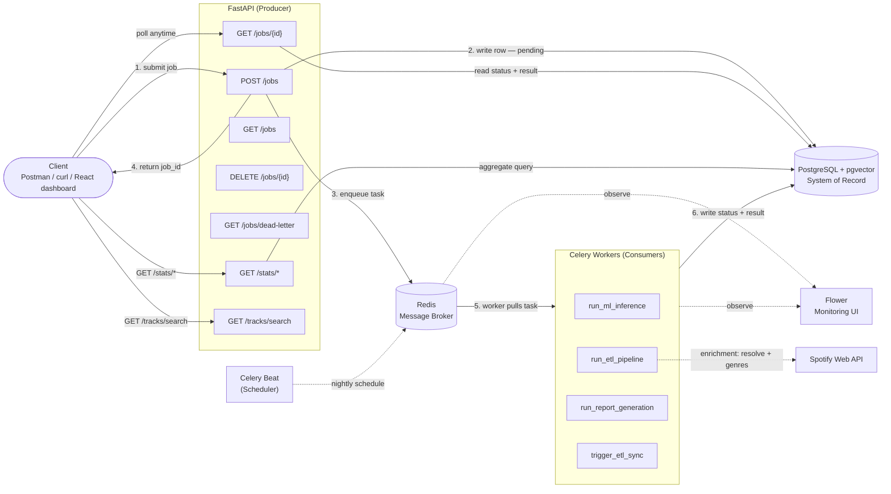
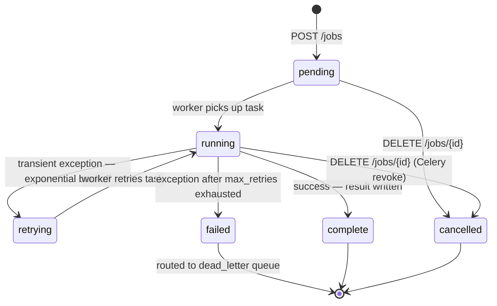

# Architecture — Distributed Job Processing Platform

---

## 1. System Design Overview

The platform follows a **producer–broker–consumer** pattern, the standard architecture for asynchronous background processing.

| Role | Component | Responsibility |
|---|---|---|
| Producer | FastAPI | Accepts requests, writes job records, enqueues tasks |
| Scheduler | Celery Beat | Fires a scheduled ETL sync nightly — produces work autonomously |
| Broker | Redis | Holds pending tasks, decouples submission from execution |
| Consumer | Celery Workers | Pulls tasks, executes job logic, writes results |
| Store | PostgreSQL + pgvector | Durable record of every job, plus track embeddings for similarity search |

The API never executes work. It hands off immediately and returns a `job_id` to the client in under 100ms regardless of how long the job takes. If a worker is busy or crashes, Redis buffers the work and preserves it.

---

## 2. System Diagram



---

## 3. Core Components

### FastAPI — the Producer
The public-facing API. Validates incoming requests with Pydantic v2, writes the initial job record to Postgres, and enqueues the task to Redis. Returns `job_id` immediately without waiting for execution.

Uses **async SQLAlchemy + asyncpg** so database calls never block the event loop. **CORS** is configured via `CORSMiddleware` (allowed origins from the `cors_origins` setting) so the React dashboard can call the API from a different origin.

Endpoints:
- `POST /jobs` — validate payload, check idempotency key, persist job as `pending`, enqueue task, return `job_id` (202 new / 200 duplicate). **Rate limited: 100 req/min per IP.**
- `GET /jobs/{id}` — read current status and result for one job
- `GET /jobs` — list recent jobs with statuses (default limit: 20)
- `DELETE /jobs/{id}` — cancel a pending or running job; revokes the Celery task and sets `status = cancelled`. **Rate limited: 100 req/min per IP.**
- `GET /jobs/dead-letter` — list permanently-failed jobs (status=failed AND retry_count >= max_retries)
- `GET /stats/top-tracks`, `GET /stats/top-artists`, `GET /stats/listening-trends` — read-only aggregate queries over `listening_history`, populated by the ETL pipeline. Query the DAO layer directly (no service layer — same pattern as `GET /jobs/{id}` and `GET /jobs`).
- `GET /tracks/search` — looks up Spotify URIs by track/artist name substring match, read-only over the `uri_to_meta` metadata embedded in `models/spotify_recommender.joblib` (lazily loaded and cached, same pattern as the worker's `_load_recommender_model`). Powers the dashboard's seed-track picker for `ml_inference` recommendation jobs; returns an empty list if the model file is absent.

Rate limiting uses **slowapi** with **Redis** as the storage backend so limits are shared across multiple FastAPI replicas. Returns `429 Too Many Requests` when exceeded.

### Celery Beat — the Scheduler
A dedicated process (6th Docker Compose service) that fires tasks on a schedule. Every night at a configurable time (`BEAT_ETL_HOUR` / `BEAT_ETL_MINUTE`, default midnight UTC) it calls `trigger_etl_sync`.

`trigger_etl_sync` is a **plain Celery task, not a `BaseJobTask`** — it is a meta-orchestrator that creates and enqueues a job (a producer), not a job processor. It checks for an existing `scheduled_etl_daily` job whose status is not terminal; if one exists it skips, otherwise it creates a Job row and enqueues `run_etl_pipeline`. This idempotency guard ensures overlapping triggers never spawn duplicate runs. The schedule is file-based (`/tmp/celerybeat-schedule`), no DB-backed scheduler.

Because enrichment is incremental (200 tracks per run), the nightly sync gradually enriches the full catalog over successive nights.

### Redis — the Message Broker and Rate Limit Store
Sits between the API and the workers. Holds pending tasks until a worker is free. Enables load smoothing during traffic spikes and buffers work when all workers are busy.

Redis serves a dual role: it is the **Celery message broker** (task queue) and the **rate limit counter store** (slowapi backend). The same Redis instance handles both — they use separate key namespaces automatically.

Critical config: `task_acks_late = True` — a task is only removed from Redis after a worker finishes it, not when it picks it up. If a worker crashes mid-execution the task returns to the queue rather than being silently lost.

### Celery Workers — the Consumers
Separate processes that continuously pull tasks from Redis and execute them. Write all status updates and results directly to Postgres. Run outside the FastAPI event loop so they use **sync SQLAlchemy + psycopg2**. Workers consume from two queues: `celery` (default) and `dead_letter`.

Registered tasks:

| Task | Type | Behavior |
|---|---|---|
| `run_ml_inference` | Real | **Dual-mode dispatch.** With `features` in the payload → fraud detection (pre-trained Random Forest, 14 features, StandardScaler, ~53ms). With `seed_tracks` → music recommender, selectable between collaborative filtering (`cooccurrence`) and content-based vector similarity (`pgvector`) via `payload.recommender`. |
| `run_etl_pipeline` | Real | Extracts Spotify streaming history JSON from `payload.source` (default `data/spotify_export`), filters/cleans plays, loads them into `listening_history` idempotently (`INSERT ... ON CONFLICT DO NOTHING` on `(artist_name, track_name, end_time)`), then runs the **enrichment phase** (see below). Fails cleanly with a descriptive error if the source directory is missing or empty. |
| `run_report_generation` | Mocked | `time.sleep(3–6s)`, writes fake report result. |
| `trigger_etl_sync` | Scheduler | Fired by Celery Beat. Creates + enqueues a scheduled ETL job under an idempotency key. Plain `@app.task`, not a `BaseJobTask`. |

**ETL enrichment phase** — runs after the load. It dedups unique `(artist, track)` pairs, skips any already present in `track_metadata` (idempotent, cheap re-runs), and for unresolved tracks: searches the Spotify API to resolve track + artist IDs, batch-fetches artist genres (up to 50 IDs per request), generates a sentence-transformer embedding from `"{artist} | {track} | {genres}"`, and stores it in `track_metadata`. The phase is **non-fatal** — missing credentials or API errors are logged and skipped so the ETL load always succeeds — and **rate-limit-aware** (delay between calls, capped Retry-After sleep, 200-track batch limit per run).

### Spotify API Client
A sync client (`worker/clients/spotify.py`) used by the enrichment phase. Uses the **Client Credentials** OAuth flow (no user login), caches the access token and refreshes it on expiry (~1 hour), and retries on `429` while respecting a capped `Retry-After`. Exposes track search and batched artist-metadata lookup. Credentials come from `SPOTIFY_CLIENT_ID` / `SPOTIFY_CLIENT_SECRET` via pydantic-settings.

> The original design used Spotify's audio-features endpoint for content-based recommendations. Spotify deprecated that endpoint for new apps in November 2024, so the platform pivoted to genre + metadata text embeddings, which rely only on the still-available search and artist endpoints.

### PostgreSQL + pgvector — the System of Record
Durable store for all job state and track embeddings. Redis is in-memory and transient; Postgres survives restarts and is the source of truth. All client reads go to Postgres via the API — never directly to the queue.

The image is `pgvector/pgvector:pg16`, and `migrations/init.sql` enables the `vector` extension. The `track_metadata` table stores a `vector(384)` embedding column; the content-based recommender runs cosine-similarity queries (`ORDER BY embedding <=> centroid`) directly in the database.

### React Dashboard
A React + Vite + TypeScript single-page app (in `frontend/`) that consumes the FastAPI endpoints over HTTP. Four pages:
- **Job Monitoring** — submit / cancel / poll jobs, live recent-jobs table, dead-letter view
- **Queue Statistics** — status and job-type breakdowns aggregated client-side over the most recent 500 jobs (with a visible caveat), plus a Flower link
- **Recommendations** — seed-track autocomplete (backed by `/tracks/search`), listening analytics (top tracks/artists/trends), and a toggle to compare the collaborative and content-based recommenders
- **Job Execution History** — filterable browse table over recent jobs

### Flower — Monitoring
Read-only dashboard connected to Redis and workers. Shows live worker status, task throughput, and failure rates. Runs as a Docker Compose service on port 5555.

---

## 4. Data Flow

### Submission flow
```
Client
  │
  ├─► POST /jobs {job_type, payload}
  │
FastAPI
  ├─► Pydantic validates payload
  ├─► SQLAlchemy writes job row → Postgres (status: pending)
  ├─► Celery enqueues task → Redis
  └─► Returns {job_id, status: pending} to client  ◄── client unblocked here
```

### Scheduled flow (Celery Beat)
```
Celery Beat (nightly)
  │
  └─► fires trigger_etl_sync → Redis
        │
      Worker
        ├─► checks for active scheduled_etl_daily job (idempotency guard)
        ├─► creates Job row → Postgres (status: pending)
        └─► enqueues run_etl_pipeline → Redis
```

### Execution flow
```
Redis
  │
  └─► Celery worker pulls task (job_id)
        │
        ├─► Updates job row → Postgres (status: running, started_at: now)
        ├─► Executes task logic
        │
        ├─► SUCCESS
        │     └─► Updates job row → Postgres (status: complete, result: {...}, completed_at: now)
        │         Acknowledges task to Redis
        │
        └─► FAILURE
              └─► Updates job row → Postgres (status: failed, error: "...", completed_at: now)
                  Acknowledges task to Redis
```

### Retrieval flow
```
Client
  │
  └─► GET /jobs/{id}
          │
        FastAPI
          └─► Reads job row from Postgres
                └─► Returns {job_id, status, result, error, timestamps}
```

---

## 5. Data Model

### `jobs` table

| Column | Type | Nullable | Description |
|---|---|---|---|
| `id` | UUID | No (PK) | Generated by application on submission; returned as `job_id` |
| `job_type` | VARCHAR | No | `ml_inference`, `etl_pipeline`, `report_generation` |
| `status` | VARCHAR | No | `pending`, `running`, `retrying`, `complete`, `failed`, `cancelled` |
| `payload` | JSONB | No | Input data submitted with the job |
| `result` | JSONB | Yes | Output written by worker on success |
| `error` | TEXT | Yes | Error message written by worker on failure or retry |
| `created_at` | TIMESTAMP | No | Set on job creation by FastAPI |
| `started_at` | TIMESTAMP | Yes | Set by worker when execution begins |
| `completed_at` | TIMESTAMP | Yes | Set by worker when job finishes, fails, or is cancelled |
| `idempotency_key` | VARCHAR | Yes | Client-supplied deduplication key; indexed |
| `retry_count` | INTEGER | No | Incremented on each retry attempt (default 0) |
| `max_retries` | INTEGER | No | Maximum retries before permanent failure (default 3) |

`payload` and `result` are JSONB so each job type can carry a different shape of data without requiring separate tables.

`id` is a UUID generated by the application, not a Postgres serial integer — job identity is decoupled from database insertion order.

### `listening_history` table

Populated by `run_etl_pipeline` from Spotify streaming history exports. Queried read-only by the `/stats/*` endpoints.

| Column | Type | Nullable | Description |
|---|---|---|---|
| `id` | UUID | No (PK) | Generated by Postgres (`gen_random_uuid()`) |
| `artist_name` | VARCHAR | No | Artist name from the streaming history entry |
| `track_name` | VARCHAR | No | Track name from the streaming history entry |
| `end_time` | TIMESTAMP | No | When the play ended, parsed from `endTime` (`%Y-%m-%d %H:%M`) |
| `ms_played` | INTEGER | No | Milliseconds played |
| `imported_at` | TIMESTAMP | No | Set by Postgres (`NOW()`) when the row is loaded |

`UNIQUE(artist_name, track_name, end_time)` is what makes the ETL idempotent — the worker loads rows via `INSERT ... ON CONFLICT DO NOTHING`, so re-running the pipeline against the same export never creates duplicate plays.

### `track_metadata` table

Populated by the ETL **enrichment phase**. Stores Spotify-resolved metadata and the vector embedding used by the content-based recommender.

| Column | Type | Nullable | Description |
|---|---|---|---|
| `id` | UUID | No (PK) | Generated by application (`uuid4`) |
| `spotify_track_id` | VARCHAR | Yes | Resolved Spotify track ID |
| `artist_name` | VARCHAR | No | Artist name (matches `listening_history`) |
| `track_name` | VARCHAR | No | Track name (matches `listening_history`) |
| `spotify_artist_id` | VARCHAR | Yes | Resolved Spotify artist ID |
| `genres` | TEXT[] | Yes | Artist genres from the Spotify API (may be empty) |
| `popularity` | INTEGER | Yes | Track popularity score |
| `embedding` | vector(384) | Yes | sentence-transformer embedding of `"{artist} \| {track} \| {genres}"` |
| `enriched_at` | TIMESTAMP | No | Set when the row is enriched |

`UNIQUE(artist_name, track_name)` makes enrichment idempotent — tracks already present are skipped, so re-runs only process new tracks. Requires the `vector` extension (`CREATE EXTENSION IF NOT EXISTS vector`).

---

## 6. Job Lifecycle



Step-by-step:

1. **Submit** — Client sends `POST /jobs` with `job_type`, `payload`, and optional `idempotency_key` (or Celery Beat fires `trigger_etl_sync`, which creates the job internally)
2. **Dedup** — FastAPI checks `idempotency_key`; returns existing job (200) if already submitted
3. **Validate** — FastAPI validates payload shape with Pydantic v2
4. **Persist** — FastAPI writes job row to Postgres with `status = pending`, generates UUID `job_id`
5. **Enqueue** — FastAPI sends Celery task to Redis, setting `task_id = job_id` to enable later revocation
6. **Respond** — FastAPI returns `job_id` to client immediately (202) — request is complete
7. **Pick up** — Free Celery worker pulls task from Redis, sets `status = running`, sets `started_at`
8. **Execute** — Worker runs task logic (fraud inference, recommendation, ETL + enrichment, or mocked work)
9. **Retry** — On transient exception: `on_retry` sets `status = retrying`, increments `retry_count`; worker retries with exponential backoff (`2^n + jitter` seconds)
10. **Finalize** — Worker writes result or error, sets final status and `completed_at`, acknowledges task to Redis
11. **Dead-letter** — If retries exhausted: `on_failure` routes job to `dead_letter` queue; job visible via `GET /jobs/dead-letter`
12. **Cancel** — Client sends `DELETE /jobs/{id}`; API calls `celery.control.revoke(task_id, terminate=True)` and sets `status = cancelled`. The worker calls `db.refresh(job)` before writing its final result and skips the write if the job was cancelled mid-execution — closing the race between cancel and completion.
13. **Retrieve** — Client polls `GET /jobs/{id}` until status is terminal

---

## 7. Key Design Decisions

**The API never executes work.** Validates, persists, enqueues only. This is the core principle that keeps the system fast and is the main architectural point of the project.

**Postgres is the source of truth, not Redis.** Redis holds work-in-flight. Postgres holds the durable record. These are different responsibilities and must not be conflated.

**`task_acks_late = True` always.** Default Celery behavior acknowledges on receipt — a worker crash loses the job permanently. This setting ensures acknowledgment only after completion.

**Two separate SQLAlchemy session setups.** FastAPI uses async SQLAlchemy + asyncpg. Celery workers use sync SQLAlchemy + psycopg2. They run in different process contexts and must not share sessions.

**Workers own their status updates.** The worker — not the API — is responsible for writing `running`, `complete`, and `failed` statuses, and for setting `started_at` and `completed_at`. The API only sets the initial `pending` state.

**Schema owned exclusively by `init.sql`.** No `create_all`/`drop_all` anywhere in application or test code. A single SQL migration is the auditable source of truth for all three tables (`jobs`, `listening_history`, `track_metadata`) — avoiding cross-table destruction when multiple ORM models share one declarative `Base`.

**The scheduler is a producer, not a processor.** `trigger_etl_sync` is a plain Celery task that creates and enqueues jobs. Giving it the job-processor base class (`BaseJobTask`) would attach retry/dead-letter behavior it doesn't need; if it fails, Beat simply retries at the next interval.

**Enrichment is non-fatal.** The Spotify enrichment phase never fails the ETL load. External API outages or missing credentials degrade gracefully (no embeddings for those tracks) rather than failing the whole pipeline.

**Two recommenders kept side by side.** Collaborative filtering and content-based vector similarity run behind a payload flag, enabling direct comparison rather than blind replacement.

**Polling for status.** Clients poll `GET /jobs/{id}`. WebSocket push is deferred — it adds complexity without changing the core architecture.

**Named per-type queues are a future enhancement.** Today all job types share the default `celery` queue (plus `dead_letter`). Routing `ml`, `etl`, and `report` to dedicated queues with per-queue concurrency is a planned v2 item.

---

## 8. Deployment Topology

### Current — Local Docker Compose (6 services)

```
docker-compose.yml
├── fastapi      → uvicorn app.main:app --host 0.0.0.0 --port 8000
├── worker       → celery -A worker.celery_app worker --loglevel=info -Q celery,dead_letter
├── beat         → celery -A worker.celery_app beat --loglevel=info --schedule=/tmp/celerybeat-schedule
├── flower       → celery -A worker.celery_app flower --port=5555
├── redis        → redis:7-alpine
└── postgres     → pgvector/pgvector:pg16 (runs migrations/init.sql on startup)
```

The React dashboard runs separately via the Vite dev server (`npm run dev`, port 5173) and talks to the FastAPI service over HTTP.

> Because the schema is owned by `init.sql` (which only runs on a fresh volume), any schema change or Postgres image swap requires a one-time `docker compose down -v` followed by `docker compose up --build`.

### Post-deployment — AWS

| Service | Local | AWS |
|---|---|---|
| FastAPI | Docker container | Docker container on EC2 |
| Celery worker | Docker container | Docker container on EC2 |
| Celery Beat | Docker container | Docker container on EC2 |
| Redis | Docker container | AWS ElastiCache (managed) |
| PostgreSQL + pgvector | Docker container | AWS RDS (managed, pgvector enabled) |
| Flower | Docker container | Docker container on EC2 |

The application code does not change between environments. Only the Redis and Postgres connection strings in `.env` change — pointing to ElastiCache and RDS instead of local containers. The same `docker-compose.yml` runs on EC2.