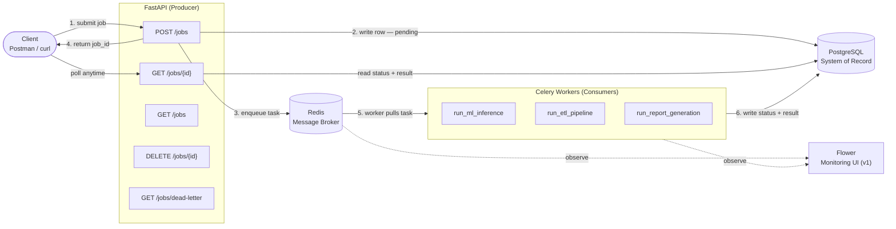
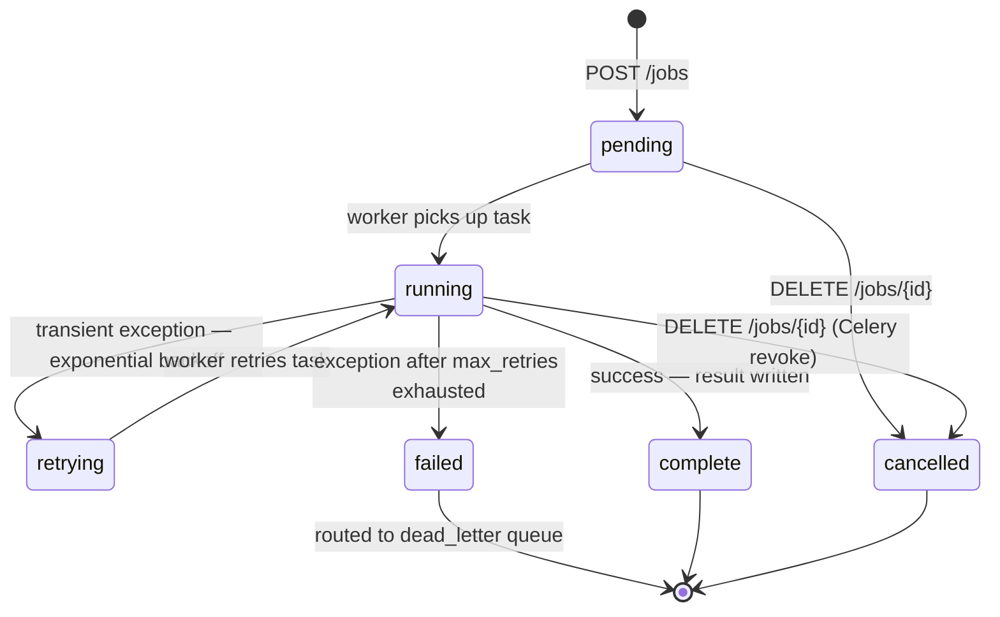

# Architecture — Distributed Job Processing Platform

---

## 1. System Design Overview

The platform follows a **producer–broker–consumer** pattern, the standard architecture for asynchronous background processing.

| Role | Component | Responsibility |
|---|---|---|
| Producer | FastAPI | Accepts requests, writes job records, enqueues tasks |
| Broker | Redis | Holds pending tasks, decouples submission from execution |
| Consumer | Celery Workers | Pulls tasks, executes job logic, writes results |
| Store | PostgreSQL | Durable record of every job — status, payload, result |

The API never executes work. It hands off immediately and returns a `job_id` to the client in under 100ms regardless of how long the job takes. If a worker is busy or crashes, Redis buffers the work and preserves it.

---

## 2. System Diagram



---

## 3. Core Components

### FastAPI — the Producer
The public-facing API. Validates incoming requests with Pydantic v2, writes the initial job record to Postgres, and enqueues the task to Redis. Returns `job_id` immediately without waiting for execution.

Uses **async SQLAlchemy + asyncpg** so database calls never block the event loop.

Endpoints:
- `POST /jobs` — validate payload, check idempotency key, persist job as `pending`, enqueue task, return `job_id` (202 new / 200 duplicate)
- `GET /jobs/{id}` — read current status and result for one job
- `GET /jobs` — list recent jobs with statuses (default limit: 20)
- `DELETE /jobs/{id}` — cancel a pending or running job; revokes the Celery task and sets `status = cancelled`
- `GET /jobs/dead-letter` — list permanently-failed jobs (status=failed AND retry_count >= max_retries)

### Redis — the Message Broker
Sits between the API and the workers. Holds pending tasks until a worker is free. Enables load smoothing during traffic spikes and buffers work when all workers are busy.

Critical config: `task_acks_late = True` — a task is only removed from Redis after a worker finishes it, not when it picks it up. If a worker crashes mid-execution the task returns to the queue rather than being silently lost.

### Celery Workers — the Consumers
Separate processes that continuously pull tasks from Redis and execute them. Write all status updates and results directly to Postgres. Run outside the FastAPI event loop so they use **sync SQLAlchemy + psycopg2**.

Three registered tasks:

| Task | Type | Behavior |
|---|---|---|
| `run_ml_inference` | Real | Loads pre-trained model at startup, runs `.predict()` on payload features |
| `run_etl_pipeline` | Mocked | `time.sleep(5–8s)`, writes fake transform result |
| `run_report_generation` | Mocked | `time.sleep(3–6s)`, writes fake report result |

### PostgreSQL — the System of Record
Durable store for all job state. Redis is in-memory and transient; Postgres survives restarts and is the source of truth. All client reads go to Postgres via the API — never directly to the queue.

### Flower — Monitoring (v1)
Read-only dashboard connected to Redis and workers. Shows live worker status, task throughput, and failure rates. Added in v1 as a fifth Docker Compose service.

---

## 4. Data Flow

### Submission flow
```
Client
  │
  ├─► POST /jobs {job_type, payload}
  │
FastAPI
  ├─► Pydantic validates payload
  ├─► SQLAlchemy writes job row → Postgres (status: pending)
  ├─► Celery enqueues task → Redis
  └─► Returns {job_id, status: pending} to client  ◄── client unblocked here
```

### Execution flow
```
Redis
  │
  └─► Celery worker pulls task (job_id)
        │
        ├─► Updates job row → Postgres (status: running, started_at: now)
        ├─► Executes task logic
        │
        ├─► SUCCESS
        │     └─► Updates job row → Postgres (status: complete, result: {...}, completed_at: now)
        │         Acknowledges task to Redis
        │
        └─► FAILURE
              └─► Updates job row → Postgres (status: failed, error: "...", completed_at: now)
                  Acknowledges task to Redis
```

### Retrieval flow
```
Client
  │
  └─► GET /jobs/{id}
          │
        FastAPI
          └─► Reads job row from Postgres
                └─► Returns {job_id, status, result, error, timestamps}
```

---

## 5. Data Model

Single table for the MVP. Additional tables (execution logs, worker metrics) added in v2.

### `jobs` table

| Column | Type | Nullable | Description |
|---|---|---|---|
| `id` | UUID | No (PK) | Generated by application on submission; returned as `job_id` |
| `job_type` | VARCHAR | No | `ml_inference`, `etl_pipeline`, `report_generation` |
| `status` | VARCHAR | No | `pending`, `running`, `retrying`, `complete`, `failed`, `cancelled` |
| `payload` | JSONB | No | Input data submitted with the job |
| `result` | JSONB | Yes | Output written by worker on success |
| `error` | TEXT | Yes | Error message written by worker on failure or retry |
| `created_at` | TIMESTAMP | No | Set on job creation by FastAPI |
| `started_at` | TIMESTAMP | Yes | Set by worker when execution begins |
| `completed_at` | TIMESTAMP | Yes | Set by worker when job finishes, fails, or is cancelled |
| `idempotency_key` | VARCHAR | Yes | Client-supplied deduplication key; indexed |
| `retry_count` | INTEGER | No | Incremented on each retry attempt (default 0) |
| `max_retries` | INTEGER | No | Maximum retries before permanent failure (default 3) |

`payload` and `result` are JSONB so each job type can carry a different shape of data without requiring separate tables.

`id` is a UUID generated by the application, not a Postgres serial integer — job identity is decoupled from database insertion order.

---

## 6. Job Lifecycle



Step-by-step:

1. **Submit** — Client sends `POST /jobs` with `job_type`, `payload`, and optional `idempotency_key`
2. **Dedup** — FastAPI checks `idempotency_key`; returns existing job (200) if already submitted
3. **Validate** — FastAPI validates payload shape with Pydantic v2
4. **Persist** — FastAPI writes job row to Postgres with `status = pending`, generates UUID `job_id`
5. **Enqueue** — FastAPI sends Celery task to Redis, setting `task_id = job_id` to enable later revocation
6. **Respond** — FastAPI returns `job_id` to client immediately (202) — request is complete
7. **Pick up** — Free Celery worker pulls task from Redis, sets `status = running`, sets `started_at`
8. **Execute** — Worker runs task logic (real inference or mocked work)
9. **Retry** — On transient exception: `on_retry` sets `status = retrying`, increments `retry_count`; worker retries with exponential backoff (`2^n + jitter` seconds)
10. **Finalize** — Worker writes result or error, sets final status and `completed_at`, acknowledges task to Redis
11. **Dead-letter** — If retries exhausted: `on_failure` routes job to `dead_letter` queue; job visible via `GET /jobs/dead-letter`
12. **Cancel** — Client sends `DELETE /jobs/{id}`; API calls `celery.control.revoke(task_id, terminate=True)` and sets `status = cancelled`
13. **Retrieve** — Client polls `GET /jobs/{id}` until status is terminal

---

## 7. Key Design Decisions

**The API never executes work.** Validates, persists, enqueues only. This is the core principle that keeps the system fast and is the main architectural point of the project.

**Postgres is the source of truth, not Redis.** Redis holds work-in-flight. Postgres holds the durable record. These are different responsibilities and must not be conflated.

**`task_acks_late = True` always.** Default Celery behavior acknowledges on receipt — a worker crash loses the job permanently. This setting ensures acknowledgment only after completion.

**Two separate SQLAlchemy session setups.** FastAPI uses async SQLAlchemy + asyncpg. Celery workers use sync SQLAlchemy + psycopg2. They run in different process contexts and must not share sessions.

**Workers own their status updates.** The worker — not the API — is responsible for writing `running`, `complete`, and `failed` statuses, and for setting `started_at` and `completed_at`. The API only sets the initial `pending` state.

**Polling for the MVP.** Clients poll `GET /jobs/{id}` for status updates. WebSocket push is deferred to the Later milestone — it adds complexity without changing the core architecture.

**One worker process, one queue for the MVP.** All three job types run in a single worker. Named per-type queues (`ml-queue`, `etl-queue`, `report-queue`) are a v2 enhancement.

---

## 8. Deployment Topology

### MVP — Local Docker Compose (4 services)

```
docker-compose.yml
├── fastapi      → uvicorn app.main:app --host 0.0.0.0 --port 8000
├── worker       → celery -A worker.celery_app worker --loglevel=info
├── redis        → redis:7-alpine
└── postgres     → postgres:16-alpine (runs migrations/init.sql on startup)
```

### v1 — Local Docker Compose (5 services)

```
docker-compose.yml
├── fastapi      → uvicorn app.main:app --host 0.0.0.0 --port 8000
├── worker       → celery -A worker.celery_app worker --loglevel=info -Q celery,dead_letter
├── flower       → celery -A worker.celery_app flower --port=5555
├── redis        → redis:7-alpine
└── postgres     → postgres:16-alpine (runs migrations/init.sql on startup)
```

### Post-MVP — AWS

| Service | Local | AWS |
|---|---|---|
| FastAPI | Docker container | Docker container on EC2 |
| Celery worker | Docker container | Docker container on EC2 |
| Redis | Docker container | AWS ElastiCache (managed) |
| PostgreSQL | Docker container | AWS RDS (managed) |
| Flower (v1) | Docker container | Docker container on EC2 |

The application code does not change between environments. Only the Redis and Postgres connection strings in `.env` change — pointing to ElastiCache and RDS instead of local containers. The same `docker-compose.yml` runs on EC2.
